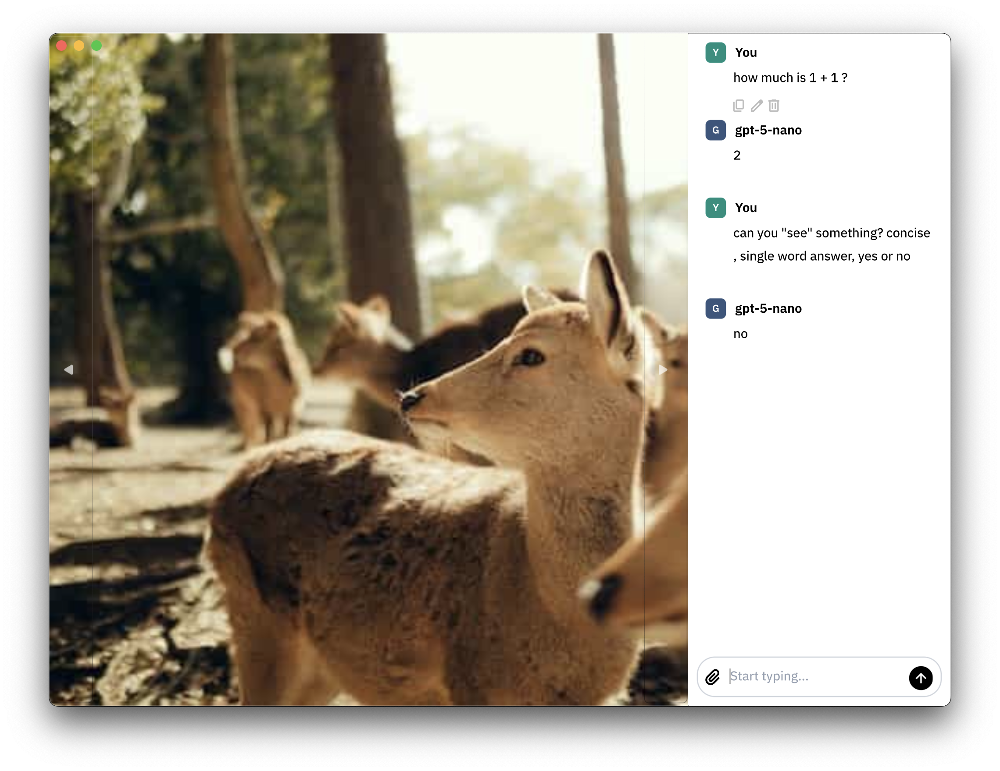

# 1 - Embedding an LLM Chat

## Introduction

In this step will look at how to add and configure an LLM chat into our image
viewer slideshow.

At the end of this step, the chat will be fully functional but lack integration
with the current image being displayed, as we will explore that on next parts
of the tutorial.

## Screenshots



## Steps

### Overview

To accomplish this, we will simply follow [Moly Kit's recepie](https://moxin-org.github.io/moly/basics.html).

This can be breaked into 3 parts:

1. Add Moly Kit dependency andu se a compatible Makepad version.
2. Register Moly Kit widgets the Makepad way.
3. Create a `BotContext` and give it to the `Chat` widget (we will
explain this later).

We will also do a 4th step to make the UI look and feel better.

### 1. Adding Moly Kit to our project

Basically, your dependencies in `Cargo.toml` should look like the following:

```toml
[dependencies]
makepad-widgets = { git = "https://github.com/wyeworks/makepad", branch = "moly" }
moly-kit = { git = "https://github.com/moxin-org/moly.git", features = ["full"], branch = "main" }
```

We include Moly Kit from GitHub as it's not on crate.io yet. The `full` feature
flag will gives the easiest setup possible. 

We will need to use a patched version of Makepad as well. This is because
currently Moly Kit focus is to be used inside Moly, an LLM app that moves fast
and usually requires specific Makepad patches to keep working.

This requirements will disappear once Moly Kit is moved to it's own repo with a
more stable branch, but for now we will work with these dependencies for this
tutorial.

### 2. Registering Moly Kit widgets

Similar to how we registered the core Makepad widgets in our app `live_register`
function, we should also register the widgets from the `moly_kit` crate.

You should modify `live_register` to look like the following:

```rust
impl LiveRegister for App {
    fn live_register(cx: &mut Cx) {
        makepad_widgets::live_design(cx);
        moly_kit::live_design(cx); // Added this line.
    }
}
```

Then on the DSL we should include the `Chat` widget by adding:

```rust
use moly_kit::widgets::chat::Chat;
```

And for this tutorial, we will add a chat to the right of our slideshow, so
let's modify our previous DSL like this:


```rust
Slideshow = <View> {
    // We wrapped what we had with this view to get a horizontal layout.
    <View> {
        flow: Overlay,

        image = <Image> {
            width: Fill,
            height: Fill,
            fit: Biggest,
            source: (PLACEHOLDER)
        }

        overlay = <SlideshowOverlay> {}
    }

    // We added the `Chat` widget.
    chat = <Chat> {
        padding: 10,
        width: 300,
        // We hide the chat by default. We will make it programatically visible
        // once models are ready inside the `BotContext` (next step).
        visible: false,
        draw_bg: {
            border_radius: 0.0,
            color: #fff
        }
    }
}
```

### 3. Configuring the `Chat` widget

Moly Kit's `Chat` is designed in a way it works out of the box like any other
LLM chat application. You won't need to handle button presses yourself, but
you will need to configure it to use a proper API and LLM model.

For our purposes of interacting with a conversational model under an OpenAI
compatible endpoint, the following steps should be done:
1. Create an `OpenAIClient`, pointing to the proper API URL.
2. Configure the client with the proper API key.
3. Generate a `BotContext` from our single client.
4. Set this `BotContext` as the one to be used in `Chat`.
5. Spawn an async task to boostrap (load) the `BotContext`.

As you may expect, `OpenAIClient` is what defines how to hit OpenAIs
conversational endpoint. But what is `BotContext` and why do we need to
"load" it asynchronusly? 

In Moly Kit terms, a "Bot" is anything automated we can talk to. Like pure LLM
models or agentic workflows. A `BotContext` is basically a synchronous
container, with models preloaded, that is passed down the widget tree of `Chat`
so all widget have syncrhonous access to the list of available models. It's
a key part of integrating the asynchronous, streaming, Moly Kit clients with
the syncrhonous Makepad widgets.

Currently, `Chat` doesn't handle bots loading automatically, so we need to
trigger and wait the load outselves before displaying it. There are future plans
to eliminate the need of this for simple cases like ours, but it's currently not
the case.

Okey, so let's start writing the code.

You will want to prepare the following aliases:

```rust
use moly_kit::{
    ChatWidgetRefExt, OpenAIClient, protocol::*, utils::asynchronous::spawn,
};
```

- `moly_kit::protocol::*` it's an important one, as it contains the base types
and traits to work with Moly Kit.
- `moly_kit::OpenAIClient` is the client implementation we will use to talk to
an OpenAI compatible endpoint.
- `moly_kit::utils::asynchronous::spawn` is what we will use to spawn our future
when loading the `BotContext`.
- `ChatWidgetRefExt` is simply a Makepad autogenerated extension method to fetch
our `Chat` widget we defined in the DSL.

Now, we will also use Makepad's `UiRunner` as a concise and pragmatic alternative
to raw `Cx::post_action` usage. An `UiRunner` allows us to send boxed closures
from any thread or async task, back to our app/widget scope for execution. The
only requirement to enable it's usage is to add the following line to
your `handle_event`.

```rust
fn handle_event(&mut self, cx: &mut Cx, event: &Event) {
    self.ui_runner().handle(cx, event, &mut Scope::empty(), self);
    // ... everything we had before ...
}
```

> [!note]
>
> We are passing `&mut Scope::empty()` because we are in the root of the app.
> If we were in a normal widget, where we receive a `scope` parameter, then you
> should pass that so received closures gain access to it. 

As for the `BotContext` and other fancy details setup, let's group everything
into a separate `configure_slideshow_chat_context` function. I will document
what each part does inline with the code:

```rust
fn configure_slideshow_chat_context(&mut self, cx: &mut Cx) {
    // Get the api url and api key from enviroment variables.
    // Feel free to hard code them if you want.
    let url = std::env::var("API_URL").unwrap_or_default();
    let key = std::env::var("API_KEY").unwrap_or_default();

    // Create and configure a client to talk with the proper url and key.
    let mut client = OpenAIClient::new(url);
    client.set_key(&key).unwrap();

    // Create a `BotContext` configured to use our client.
    let mut bot_context = BotContext::from(client);

    // Give the `BotContext` to the `Chat` widget.
    let mut chat = self.ui.chat(id!(slideshow.chat));
    chat.write().set_bot_context(cx, Some(bot_context.clone()));

    // Obtain a `UiRunner` instance (which is `Copy`), so we can execute things
    // in the scope of our app from any thread or async task easly.
    let ui = self.ui_runner();

    // Use Moly Kit cross platform, Tokio enabled, web compatible, `spawn`
    // function to run our `BotContext` bootstraping code.
    spawn(async move {
        // Load the `BotContext` asyncrhonously and turn it's result into a
        // vector of errors so we can report them if any.
        let errors = bot_context.load().await.into_errors();

        // Use our `UiRunner` so we can "go back" to our app's scope.
        // We use `me` as `self`, as it's a reserved name. 
        ui.defer(move |me, cx, _scope| {
            // We create a new reference to the `Chat` widget in this scope.
            let mut chat = me.ui.chat(id!(slideshow.chat));

            // We also get a reference to the internal `Messages` widget which
            // is a child of `Chat` responsabile of holding the messages vector
            // and displaying it.
            let mut messages = chat.read().messages_ref();

            // We insert "error messages" into out chat to report problems that
            // happened during load.
            //
            // Note: You could also just "print" them, but having errors in our
            // UI will look better.
            for error in errors {
                messages.write().messages.push(Message::app_error(error));
            }

            // We search for a `Bot`, whose raw provider-side id is the one we
            // specified in our enviroment variable.
            //
            // Note: A `BotId` is composed of more information, but for this
            // tutorial, we only care about the id as it's defined in our
            // OpenAI compatible provider. That's what `.id()` returns.
            let model_id = std::env::var("MODEL_ID").unwrap_or_default();
            let bot = bot_context
                .bots()
                .into_iter()
                .find(|b| b.id.id() == model_id);

            // If we found the desired `Bot`, let's set it in the `Chat` as the
            // one to use.
            //
            // Insert another error message back to the chat otherwise.
            if let Some(bot) = bot {
                chat.write().set_bot_id(cx, Some(bot.id));
            } else {
                messages.write().messages.push(Message::app_error(
                    format!("Model ID '{}' not found", model_id),
                ));
            }

            // We finished our setup, so let's make the chat visible.
            chat.write().visible = true;
            me.ui.redraw(cx);
        });
    });
}
```

> [!info]
>
> Moly Kit avoids duplicating methods across `Chat` and Makepad's autogenerated
> `ChatRef` by giving you the `.write()` and `.read()` methods which are roughly
> shorthands to doing `.borrow_mut().unwrap()`.
>
> `ChatRef` doesn't replicate any other internal methods. Same goes for
> `MessagesRef` and other public widgets of Moly Kit.
>
> The benefits of this approach are:
> - Moly Kit developers don't have to replicate methods, doing `.clone()`s or
> `RefMut::map` hacks internally.
> - You will never experience an accidental method being defined on a ref, but
> not in it's inner widget.
> - You will never hit the inconsistency of having methods that are exposed in
> the ref version, while others require you to do `.borrow_mut().unwrap()`.

We can now call our function in `after_new_from_doc` where we also initialized
the images list in previous tutorial steps.

```rust
fn after_new_from_doc(&mut self, cx: &mut Cx) {
    // ... previous initialization code ...
    self.configure_slideshow_chat(cx);
}
```

We made an intermediate function `configure_slideshow_chat` that we will use
later but for now it should simply contain our
`configure_slideshow_chat_context` call.


```rust
fn configure_slideshow_chat(&mut self, cx: &mut Cx) {
    self.configure_slideshow_chat_context(cx);
}
```

### 4. Nice UI extras.

Would be nice if we can clear the message list every time the image in the
slideshow changes and when the slideshow itself is opened.

Let's define the following utility function:

```rust
fn clear_slideshow_chat_messages(&self) {
    self.ui
        .chat(id!(slideshow.chat))
        .read()
        .messages_ref()
        .write()
        .messages
        .clear();
}
```

Then, search where the slideshow opening event is handled and add the
corresponding call:

```rust
if self.ui.button(id!(button)).clicked(&actions) {
    self.clear_slideshow_chat_messages(); // Add this line.
    page_flip.set_active_page(cx, live_id!(slideshow));
}
```

And also call this when the image changes:

```rust
fn set_current_image(&mut self, cx: &mut Cx, image_idx: usize) {
    // ... other code ...

    self.clear_slideshow_chat_messages(); // Add this line.
    self.ui.redraw(cx);
}
```

## What we did

Now, if you run your app and go the the slideshow, you will have the chat we
embeded, and it will be working (independently of our app).

## What's Next

We will hook into our `Chat`'s pipeline to inject current image being viewed in
the slideshow as additional context. This way we will be abale to ask things
about our image.