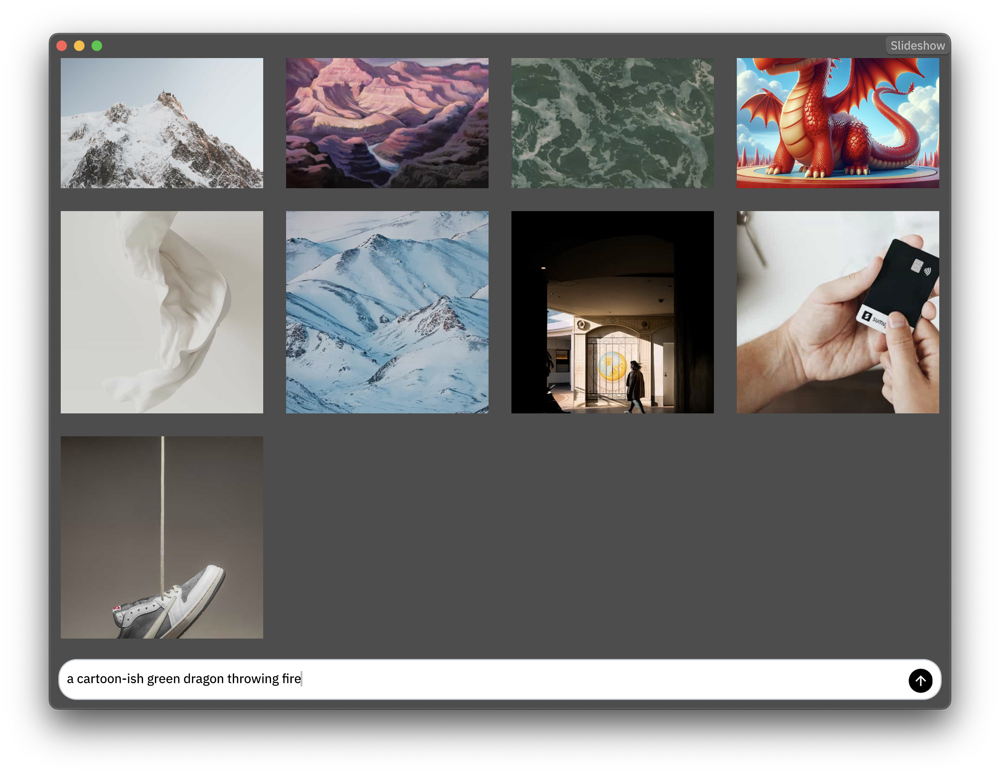
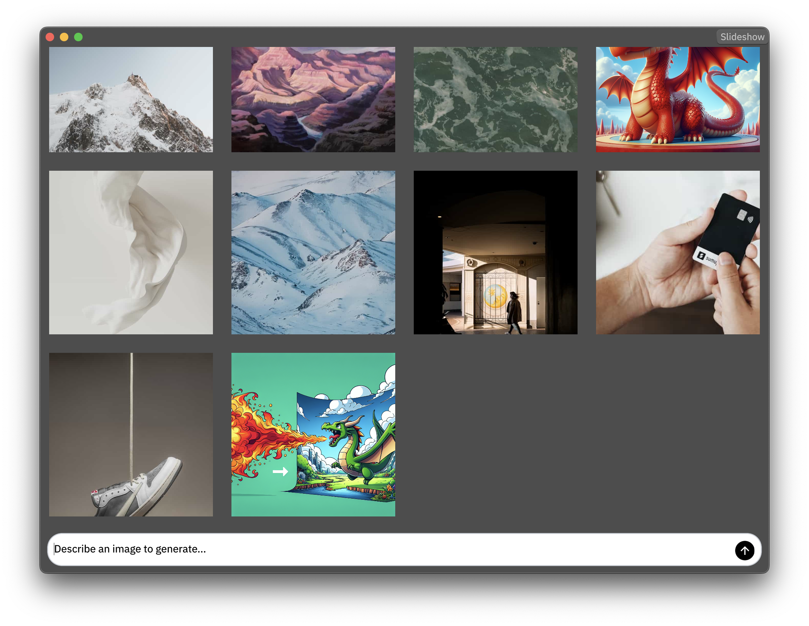

# 3 - Generating Images to the Grid

## Introduction

In this additional lesson, we will simply use what we already learned from
the previous Moly Kit lessons. It's assumed you already know how to configure
the `BotContext` required by a `Chat` and what a "chat hook" is. We will go fast
to reach our goal, but the principles are the same as previous lessons.

For this lesson, what we will do is add a new "chat" to the image grid, with the
purpose of generating new images at runtime!

## Screenshots




## Steps

### Overview

Knowing what we already know, we can achieve this following this recipe.

1. Put a new chat in the DSL so it appears at the bottom of the image grid. We
will override its DSL to hide the messages list as it will not be used, leaving
only the prompt input visible.
2. Configure the `BotContext` for this chat using the `OpenAIImageClient` as
the base. This client can talk to models like `dalle-3` or `gpt-image-1` to
produce images.
3. Configure a hook, that simply aborts all default behaviors, taking full
control of what happens when something happens in the `Chat`.

> [!tip]
>
> Although these lessons focus on integrating the `Chat` widget, you may find
> it cleaner to make your own UI to avoid the needs of hooking. If you prefer to
> do so, you can still leverage a lot of the pure Moly Kit abstractions, like
> the built-in implemented clients, attachments abstractions, async utilities,
> etc. This way, you will not need to deal with SSE, handling JSON format
> inconsistencies, fight some web compatibility issues, etc. that are already
> solved by these built-in implementations. 

### 1. Adding a new chat

Update the DSL to include the chat below the image grid, inside the image
browser.

```rust
ImageBrowser = <View> {
    flow: Down,
    menu_bar = <MenuBar> {}
    image_grid = <ImageGrid> {}

    // We added this.
    chat = <Chat> {
        height: Fit,
        padding: 10,

        // Make the chat invisible until it loads.
        visible: false,

        // Let's hide the messages list as it will never be used.
        messages = {
            visible: false
        }
        prompt = {
            persistent = {
                center = {
                    left = {
                        // Optionally, as in lesson 2, remove the "attach file"
                        // button from the left side of the prompt input to
                        // achieve a cleaner UI, although it may actually be
                        // useful to produce images from references if you don't
                        // want to hide it.
                        visible: false
                    }
                    text_input = {
                        empty_text: "Describe an image to generate..."
                    }
                }
            }
        }
    }
}
```

2. Configuring the `BotContext`.

We will then configure the `BotContext` as in previous lessons, but with the
image generation client:

```rust
impl LiveHook for App {
    fn after_new_from_doc(&mut self, cx: &mut Cx) {
        // ...other initialization calls...

        self.configure_image_browser_chat(cx);
    }
}

fn configure_image_browser_chat(&mut self, cx: &mut Cx) {
    self.configure_image_browser_chat_context(cx);
}

fn configure_image_browser_chat_context(&self, cx: &mut Cx) {
    let url = std::env::var("API_URL").unwrap_or_default();
    let key = std::env::var("API_KEY").unwrap_or_default();

    // This client knows how to use OpenAI models for image generation.
    let mut client = OpenAIImageClient::new(url);
    client.set_key(&key).unwrap();

    // Generate the `BotContext` from it.
    let mut bot_context = BotContext::from(client);

    // Set the `BotContext` for the `Chat`.
    let mut chat = self.ui.chat(id!(image_browser.chat));
    chat.write().set_bot_context(cx, Some(bot_context.clone()));

    // Bootstrap the `BotContext` by loading 
    let ui = self.ui_runner();
    spawn(async move {
        // Do the async loading and collect the errors to report them.
        let errors = bot_context.load().await.into_errors();

        // As we don't have the message list visible, let's just print the
        // errors.
        for error in errors {
            eprintln!("Error: {error}");
        }

        ui.defer(move |me, cx, _scope| {
            let mut chat = me.ui.chat(id!(image_browser.chat));

            let model_id =
                std::env::var("IMAGE_MODEL_ID").unwrap_or_default();

            // Search for the `Bot` whose provider-side id is the one we are
            // looking to generate images.
            let bot = bot_context
                .bots()
                .into_iter()
                .find(|b| b.id.id() == model_id);

            if let Some(bot) = bot {
                // Set this as the bot to use by this chat.
                chat.write().set_bot_id(cx, Some(bot.id));
            } else {
                eprintln!("Error: Image Model ID '{}' not found", model_id);
            }

            chat.write().visible = true;
            me.ui.redraw(cx);
        });
    });
}
```

3. The hook

We will use a hook as before, to detect the response from the image generation
model, which should come with an `Attachment`, to save it to our filesystem and add
it to our grid.

Hooks are very flexible, and the approach we will take here is slightly
different to the ones in the previous lessons. Inside the hook, we will:

1. Clear the tasks vector, essentially, preventing implicit default behavior from
executing.
2. Let some relevant tasks pass-through by performing them manually.
3. Hook into message insertions to always leave the chat with exactly 2
messages, the user request, and the loading AI message.
4. Hook into message updates, trying to identify the final task notifying us
with the image generation.
5. Write that image to disk, alongside other images of the grid.
6. Add the image to the grid.

The hook code is long because it does more than in the previous lessons, and
would end up looking like this:

```rust
fn configure_image_browser_chat(&mut self, cx: &mut Cx) {
    self.configure_image_browser_chat_context(cx);

    // Added this line.
    self.configure_image_browser_chat_before_hook(cx);
}

fn configure_image_browser_chat_before_hook(&mut self, _cx: &mut Cx) {
    let ui = self.ui_runner();
    self.ui
        .chat(id!(image_browser.chat))
        .write()
        .set_hook_before(move |task_group, chat, cx| {
            // Clear the task group to take full control as mentioned before.
            let aborted_tasks = std::mem::take(task_group);

            for task in aborted_tasks {
                match task {
                    // Let this task pass-through.
                    ChatTask::Send => {
                        chat.perform(cx, &[ChatTask::Send]);
                    }
                    // Let this task pass-through.
                    ChatTask::ClearPrompt => {
                        chat.perform(cx, &[ChatTask::ClearPrompt]);
                    }
                    // Handle messages insertions, expecting only two messages
                    // in perfect indexes.
                    ChatTask::InsertMessage(_, message) => {
                        match &message.from {
                            EntityId::User => {
                                chat.perform(
                                    cx,
                                    &[ChatTask::InsertMessage(0, message)],
                                );
                            }
                            EntityId::Bot(_) => {
                                chat.perform(
                                    cx,
                                    &[ChatTask::InsertMessage(1, message)],
                                );
                            }
                            _ => {}
                        }
                    }
                    // The important task to handle, which contains more complex
                    // code. Here, we will try to detect when the generated
                    // image arrives and it's ready.
                    ChatTask::UpdateMessage(_, message) => {
                        // A trick to only handle this kind of tasks once.
                        // We assume only one message update will happen before
                        // marking the message as ready, and that it will
                        // contain our image. This is the case for the
                        // `OpenAIImageClient`.
                        if !message.metadata.is_writing {
                            continue;
                        }

                        // See if there is an attachment in this message.
                        let attachment = message
                            .content
                            .attachments
                            .first()
                            .cloned();

                        // Do not continue if this message contains no
                        // attachment.
                        let Some(attachment) = attachment else {
                            return;
                        };

                        // We will want to read the attachment to write it to
                        // disk. `read()` is async, so we will use `spawn` again
                        // here.
                        spawn(async move {
                            // Read the attachment bytes content.
                            match attachment.read().await {
                                Ok(bytes) => {
                                    // Get the current time to use as a "unique filename".
                                    // Note: We are assuming generations are slow and
                                    // there is not parallel app running alongside this one.
                                    // In a serious app you should check the filesystem to
                                    // negotiate a unique filename, or generate something
                                    // unique with a lot of entropy (like an UUID v4/v7).
                                    let now = std::time::SystemTime::now().duration_since(
                                        std::time::UNIX_EPOCH,
                                    ).unwrap().as_secs();

                                    // We compute the filename, which should always be a
                                    // `.png` because that's what `OpenAIImageClient` always
                                    // requests.
                                    let filename = format!("generated_image_{now}.png");

                                    // Let's take the path where images were stored and
                                    // make the path for our file to write it.
                                    let path = Path::new(IMAGES_PATH).join(&filename);

                                    println!("Saving generated image to {path:?}");

                                    // Write the file to disk.
                                    if let Err(e) = std::fs::write(&path, &bytes) {
                                        eprintln!("Error saving generated image to {path:?}: {e}");
                                    }

                                    // Add the image path to the image grid and
                                    // display it.
                                    ui.defer(move |me, cx, _scope| {
                                        me.state.image_paths.push(path);
                                        me.ui.redraw(cx);
                                    });
                                },
                                Err(e) => {
                                    eprintln!("Error reading image generation: {e}");
                                }
                            }
                        });

                        // After getting what we want, clear the messages, so
                        // next generations are not affected by this one.
                        chat.messages_ref().write().messages.clear();
                    }
                    _ => {}
                }
            }
        });
}
```

As you can see, even if it's a little trickier to do, `Chat` allows us to take
control as much as we need.

> [!tip]
>
> But if you don't like hooking, as I mentioned earlier, you can also just use
> `OpenAIImageClient` directly with your own UI, just wait for a single
> message in the output stream of `send()` and it should contain your image (or
> an error).

## What we did

You should now be able to generate images that will get added to the image
grid, by leveraging what we already learned in previous lessons.